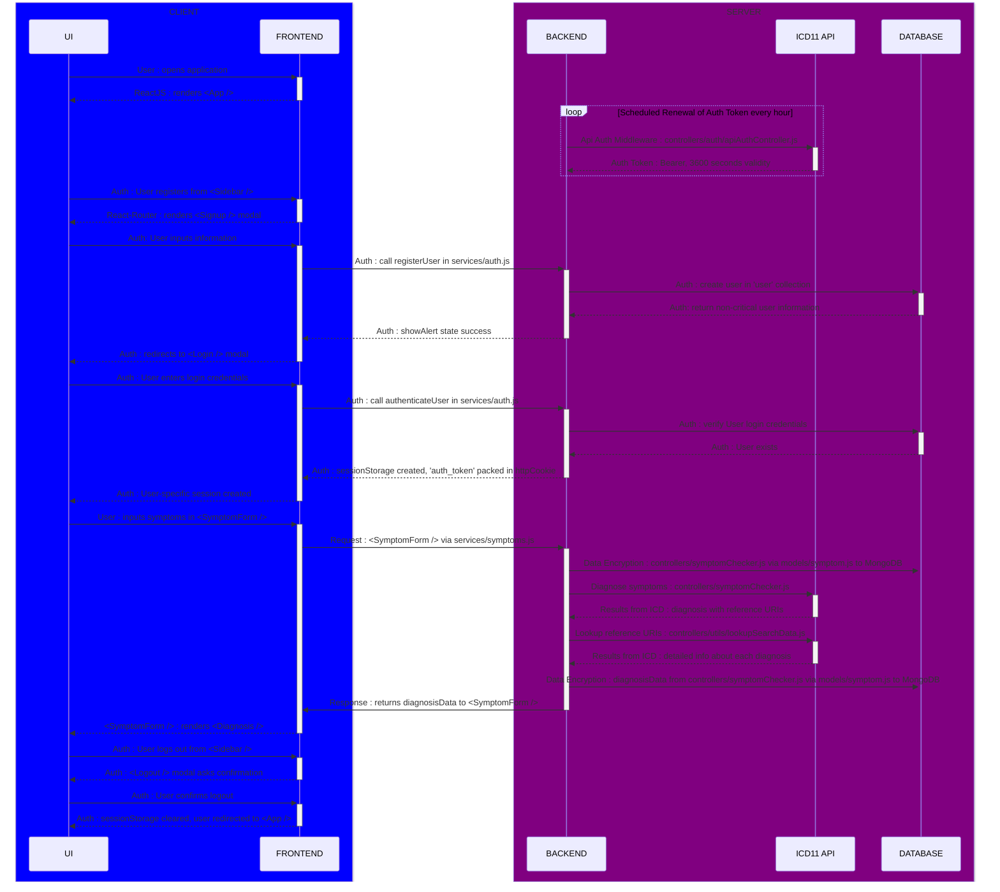

# Overview
- This file contains the README documentation for the Symptom Checker frontend project.
 
- The Symptom Checker frontend project is a web application that allows users to input their symptoms and receive possible diagnoses based on those symptoms.
- The application UI clearly displays a disclaimer at all times about the possible inaccuracies this application could generate.

- Prototype, plan and implementation of the Symptom Checker application are defined in the [prototype README](https://github.com/prak112/ICD11-SymptomChecker#overview)
- Tools and Technologies used : 
    - `react`
    - `material-ui`


## Workflow


<hr>
<br>


# Usage
- Make sure you have `node`(v`20.11.0`) and `npm`(v`10.5.0`) installed on your machine before running these commands.

- Clone the project
```bash
    git clone https://github.com/prak112/Symptom-Checker-frontend.git
```

- Install dependencies using `npm`
```bash
    cd Symptom-Checker-frontend/symptom-checker-frontend
    npm install
```

- Run the development server
```bash
    npm run dev
``` 
