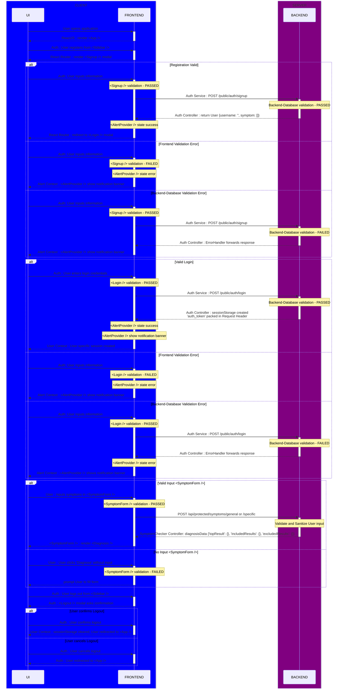

# Overview
- This repository serves as a Web Client for Symptom Checker application.
- Web Client provides a user-friendly UI for users and is responsible for :
  - communication with **[Shared Backend](https://github.com/prak112/Symptom-Checker-backend)** 
  - authentication prompt modal to register as user or guest
  - main screen with input and analysis selection for diagnosing symptoms,
  - sidebar navigation with access to auth, profile, FAQs and history,
  - loading screen with approximate response times,
  - diagnosis screen with summarized display under symptom headings with symptom-relative scoring and redirection for further reading.
- <em>A disclaimer is clear displayed at the footer of the application UI at all times about possible inaccuracies that could be generated.</em>

- Prototype, plan and implementation of the Symptom Checker application are defined in the [prototype README](https://github.com/prak112/ICD11-SymptomChecker#overview)
- Tools and Technologies used : 
    - `react`
    - `material-ui`
    - `axios`


## Workflow
- Sequence Diagram rendered using *Mermaid*
- Refer [Backend Workflow](https://github.com/prak112/Symptom-Checker-backend#workflow)



<hr>
<br>


# Usage
- Make sure you have `node`(v`20.11.0`) and `npm`(v`10.5.0`) installed on your machine before running these commands.

- Clone the project
```bash
    git clone https://github.com/prak112/Symptom-Checker-frontend.git
```

- Install dependencies using `npm`
```bash
    cd Symptom-Checker-frontend/symptom-checker-frontend
    npm install
```

- Run the development server
```bash
    npm run dev
```

<hr>
<br>

# Credits
- **Coding Assistants** : 
    - GitHub Copilot
    - Pieces Copilot
- **Documentation Tool** : Mermaid

<hr>
<hr>
